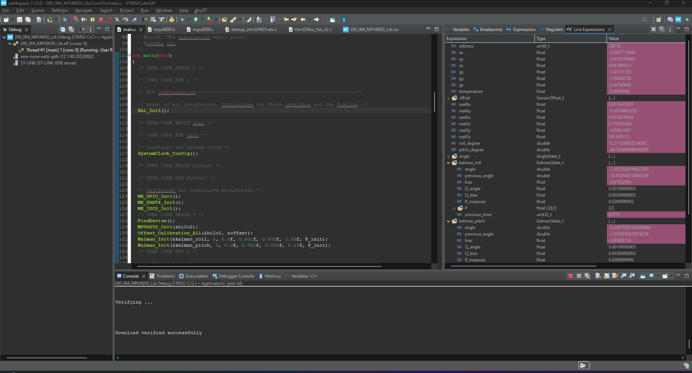
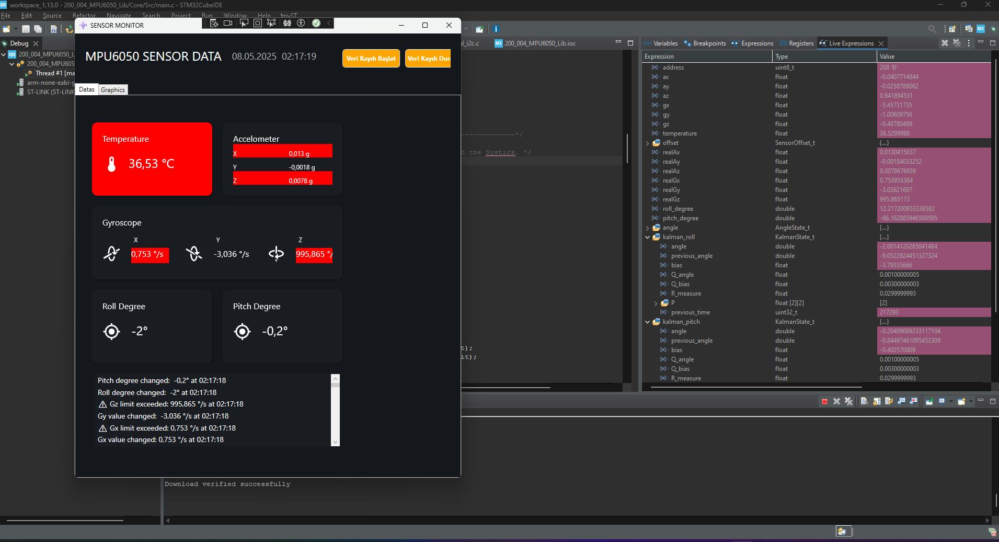
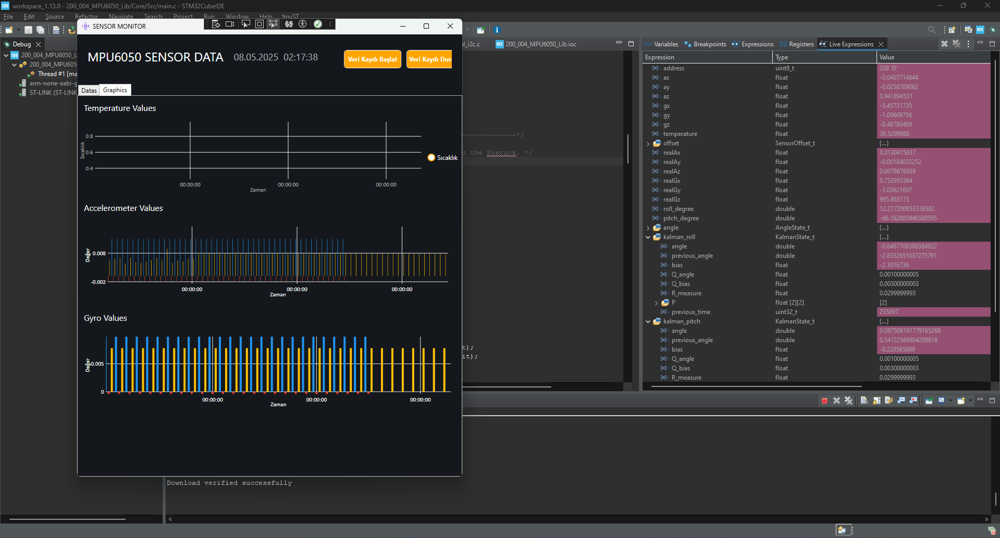

# STM32 MPU6050 Library with Kalman Filter + WPF GUI

This repository contains a complete STM32 library for interfacing with the MPU6050 IMU sensor (Accelerometer + Gyroscope),  
and a WPF GUI application to visualize, log, and monitor sensor data in real-time.

## 🧠 Features

### Embedded Firmware
- I2C communication with MPU6050
- Accelerometer and gyroscope raw value readings
- Conversion to physical units (g, °/s, °C)
- Offset calibration
- Kalman filtering for roll and pitch angles

### WPF GUI Application
- Real-time data reading from SerialPort
- Display of temperature, acceleration, gyro, and angles
- Live charting with `LiveCharts`
- CSV data logging to desktop
- Stylish MVVM-based responsive interface
- Visual alert system and dynamic color feedback

## 📷 Screenshots

### 1. STM32CubeIDE Debug View
Shows live variable values like Kalman angle, filtered axes:


### 2. WPF Sensor Monitor - Real-Time Data View
Displays sensor data with alerts and logging:


### 3. WPF Sensor Monitor - Chart View
Visualizes real-time acceleration and gyro data:


### 4. Exported CSV Data in Excel
Logged data in structured format:


## 📁 Folder Structure

```
├── Core
│   └── Src, Inc                 # STM32 project files
├── Drivers
│   └── MPU6050                  # Sensor driver code
├── WPF_GUI/
│   └── ViewModel, Helpers, XAML # C# desktop app
├── Assets                       # Icons and styles
├── README.md
```

## 🔧 Technologies Used
- STM32 HAL (C)
- C# WPF (.NET Core)
- MVVM Pattern
- LiveCharts.Wpf
- SerialPort Communication
- CSV Logging

## 📝 How to Use

1. Flash the STM32 firmware
2. Connect your PC via USB and open the WPF application
3. Select the COM port and start the sensor
4. Use “Start/Stop” buttons to record data

## ⚙️ Requirements
- STM32F407VET6 or compatible
- STM32CubeIDE
- MPU6050 sensor module
- .NET Core SDK
- Visual Studio or Rider (for WPF app)

## 👨‍💻 Author

**Hüseyin Yanar**  
[GitHub Profile](https://github.com/huseyinynr1)
